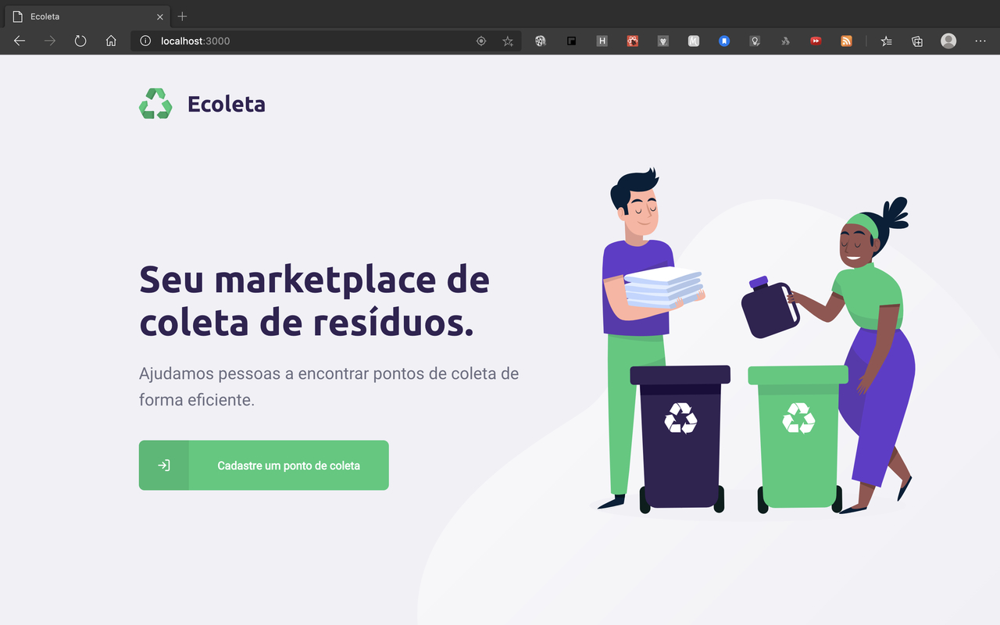
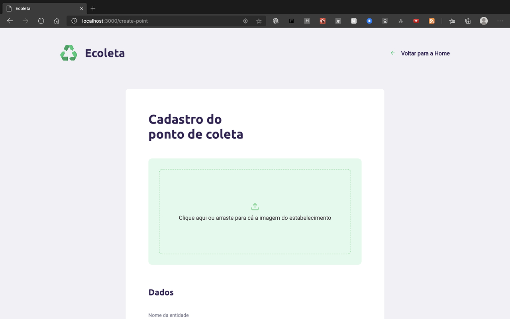
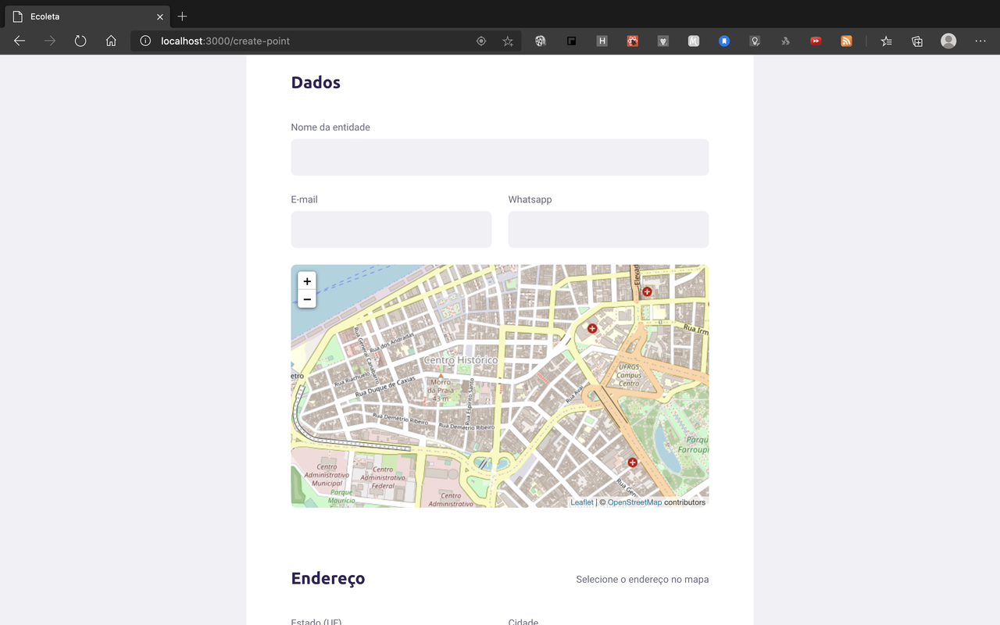
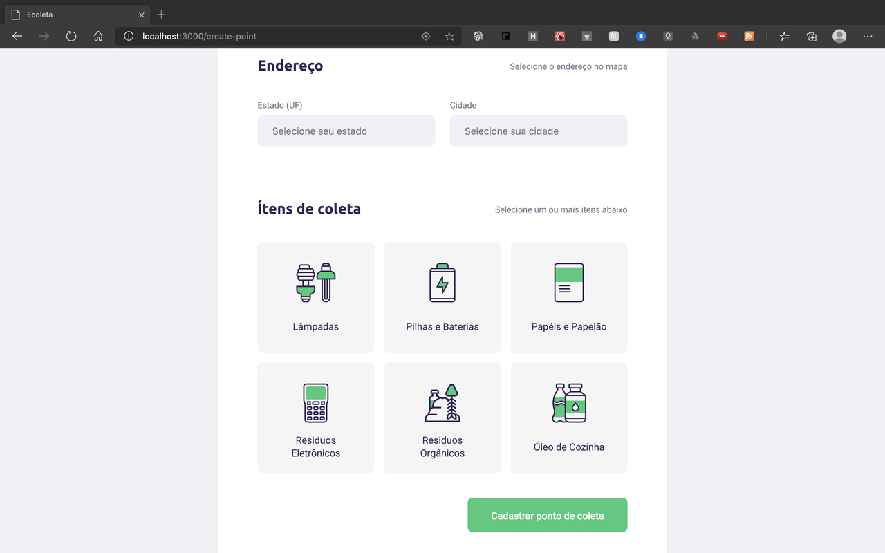
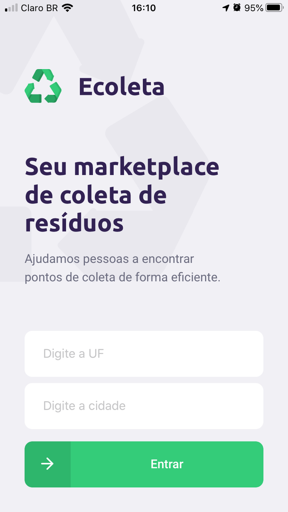
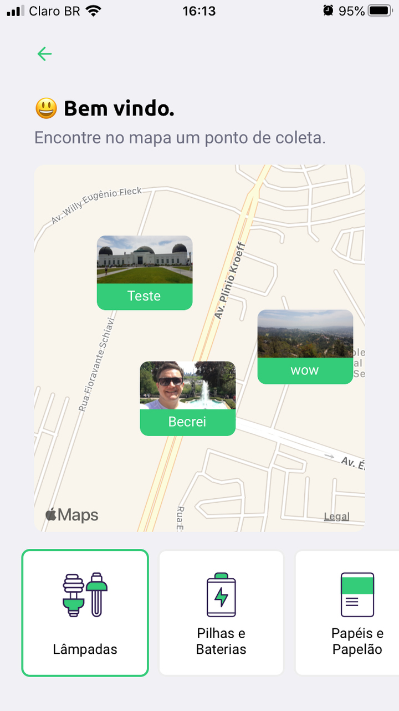
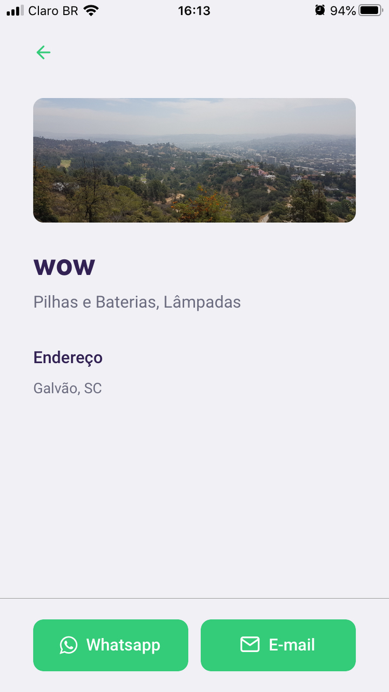

# nlw-01

Projeto Ecoleta completo

Esta semana participei do NLW (Next Level Week) onde criamos uma aplicação completa (backend, frontend e mobile).

Meu muito obrigado ao @github/diego3g e a toda turma da Rocketseat pelas toneladas de conhecimento que nos foi repassado.

A aplicação foi a "Ecoleta", que é uma plataforma que conecta pontos de coleta de resíduos, digamos, especiais (Lâmpadas, Pilhas e Baterias,etc) com pessoas que precisam fazer este tipo de descarte.

## Deixo aqui as telas finais do meu projeto:

### Projeto Web

#### Página Home Web

#### Página de criação de Pontos de coleta

### Projeto Mobile

#### Página Home Mobile

#### Página Points (Para o usuário encontrar um ponto de coleta no mapa)

#### Página Details (Para o usuário ver todos os detalhes de um ponto de coleta específicos)

## Orgulho

Foi uma semana muito intensa já que foram umas 12 horas de programação (fora de horário comercial), e também muito densa pois muitos foram os conceitos abordados.

O backend foi criado utilizando o framework Node Express, o frontend, web, foi criado em ReactJs, e a parte mobile foi em React Native.

Pude ter contato finalmente com Expo e Typescript (assuntos que eu já vinha curioso ha um tempão). E a mão na massa também abrangiu Rest API, SQLite, KNEX, Mapas, utilização de API do IBGE, upload de imagens, envio de e-mail, deep-linking com o whatsapp, entre tantos outros.
